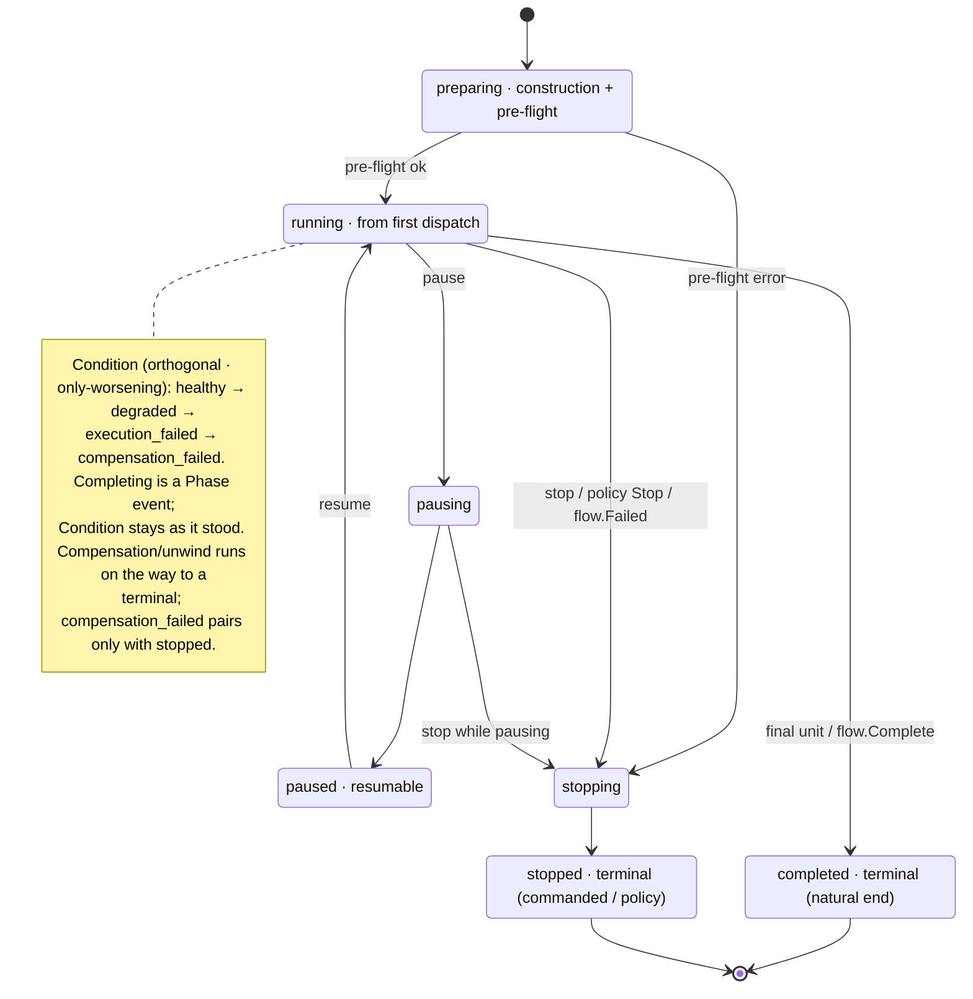

# Phase Execution: The Saga Model and the Run-State Machine

> **Status:** rewritten 2026-07-21 (phase-8 step 34, slice B) onto the landed `pkg/op` model. The pre-`op` body —
> pipeline phases as first-class runtime nodes (`Phase`, `PhaseStatus`, `Graph.Phases`, the two-level `RunPhased`
> loop, `Undo`/`Tombstone`, `internal/execution`) — is replaced. Three sections survive from the 2026-07 design work
> and are preserved: **Prior art** (step 42), **Run Status and Terminals** (step 41), and **Compensation Failure Has
> No Forward Continuation**. Companion: [`2.2-phase-execution.status.md`](2.2-phase-execution.status.md).

## Thesis

Every run is a **local saga** over the graph's unit tree. The saga's local transactions are action dispatches; its
nested scopes are subgraphs, each executed by its own child executor that owns its own recovery stack; its undo
evidence is the **receipt**. "Phase" in this document's title now means the run-lifecycle dimension of
`RunStatus{Phase, Condition, Reason}` — the pipeline-phase concept (prepare → install → verify) is a **plan-time**
construction concern owned by [2.5 lifecycle-pipeline construction](2.5-lifecycle-pipeline-construction.md); at run
time there are only units, subgraph boundaries, and the state machine below.

## The Saga Pattern

Each run is a saga — a sequence of local transactions where each transaction has a compensating action. The executor
is the saga coordinator; a subgraph is a **nested saga** whose child executor coordinates its own scope.

On success: all units complete, saga committed. On failure: completed units are compensated in LIFO order, each scope
unwinding its own recovery stack.

This is a **local saga** — the executor has full control of sequencing. Compensating actions run synchronously in
reverse order. No distributed coordination, no eventual consistency.

The model is Hector Garcia-Molina and Kenneth Salem's (*Sagas*, ACM SIGMOD 1987, pp. 249–259). Their central caveat
travels with it: a compensating action can itself fail, leaving the saga in a state that is neither committed nor
cleanly rolled back — the hazard the `compensation_failed` condition and its policy encode (see below).

## The compensable action contract — (A, C, S) as (action, compensating action, receipt)

The classical tuple maps onto the provider surface:

| Component | Realization | Example |
|-----------|-------------|---------|
| **A** (forward action) | a provider method | `file.Provider.WriteText` |
| **C** (compensating action) | the provider's `Compensate<Name>` method, activation-first | `CompensateFileMutation` |
| **S** (state A captures for C) | the **receipt** (`op.Receipt`) returned beside the result | `file.Receipt` |

A compensable action returns its result **and its receipt**; the engine-facing form is
`Action.Do(activationRecord) (Result, Compensator, error)` (`pkg/op/action.go`). The receipt is the evidence returned
by a compensable action, sufficient for `Compensate` to counteract that action's effects — it records what the
dispatch *actually did* (installed vs. already-present, created vs. replaced), because compensation is the
**semantic** inverse, not the syntactic one. A receipt **names its own undo**: `Receipt.CompensatingAction()` carries
the dotted name (e.g. `file.compensate_file_mutation`), stamped at construction, and the registry resolves it at
unwind time through the `compensatingActionIndex` — built once over every provider's `Compensate*` methods, with the
reflective invoke baked into a typed adapter at registration (reflect-once; phase-8 step 43).

Discovery is by naming convention at announce time: a `Compensate<Name>` method on the provider struct pairs with its
forward method; signatures are validated at registration, and every provider method takes the `*ActivationRecord`
first (the step-27 floor). Providers carrying compensation pairs today: archive, elevator, encryption, file, flow,
git, pkg, service.

## Recovery stacks — the tree of compensators

Every executor owns a `*RecoveryStack` (`pkg/op/recovery_stack.go`) for its own scope — the root executor for the
root subgraph, and **each subgraph dispatch's child executor for its own** ([2.3](2.3-orchestration-primitives.md)).
The stack is the saga log:

1. `Push(receipt)` — a completed action's receipt (a leaf).
2. `PushNested(childStack)` — a completed subgraph's stack, **stamped** with the subgraph's unit identity and outcome
   (`Stamp(unitID, result, err)`) — a composite.
3. `ResultByUnitID(unitID)` — downstream promise resolution reads producer results back off the stack.
4. `Unwind(runtimeEnvironment)` — LIFO compensation of every entry, best-effort (below).

The two entry kinds share one narrow interface — **`op.Compensator`**, the single method
`Compensate(runtimeEnvironment) error` (`pkg/op/action.go`). `Receipt` embeds it; `*RecoveryStack` implements it —
and is deliberately **not** a `Receipt` (a stack has no forward action, result, or transaction identity; forcing the
full interface would be a Refused Bequest). Compensation dispatch is polymorphic over `Compensator` — no type switch.

## Prior art — recovery as a tree of compensators

The recovery stack is a **tree of compensators**: a leaf is a **receipt** (one action's undo evidence), a
composite node is a **recovery stack** (a subgraph's child stack), and compensation recurses in reverse (LIFO) order,
confined to its scope. This is not a local invention — it is the mainline model across three independent bodies of work
plus the GoF Composite lineage. Recorded here because it grounds the compensator vocabulary and the `Compensator`
interface (phase-8 steps 40/42).

**Classical and nested sagas.**

- Garcia-Molina & Salem, *Sagas* (SIGMOD 1987) — the forward/compensation pairing `T1…Tn` / `Cn…C1`, reverse-order
  (LIFO) compensation, **semantic** (not before-image) undo, and the log carrying `{compensating program name, params}`
  (the classical analog of a receipt). Two-level nesting only.
  <https://www.cs.cornell.edu/andru/cs711/2002fa/reading/sagas.pdf>
- Garcia-Molina, Gawlick, Klein, Kleissner, Salem, *Modeling Long-Running Activities as Nested Sagas* (IEEE Data Eng.
  Bulletin 14(1), 1991) — defines a **"tree of nested sagas"** recursively (a transaction is a primitive saga; a
  collection is a composite saga), with the rollback rule: *committed* sub-sagas are compensated as a unit, *running*
  ones recursively aborted. <http://sites.computer.org/debull/91MAR-CD.pdf>

**Formal compensation calculi** — the tightest theory for "a scope's stack is one compensable unit."

- Bruni, Melgratti, Montanari, *Theoretical Foundations for Compensations in Flow Composition Languages* (POPL 2005) —
  a nested saga `{[P]}` accumulates its own compensation (LIFO via prepending) and settles as one step of its parent.
  <http://groups.di.unipi.it/~melgratt/publications/popl2005.pdf>
- Butler, Hoare, Ferreira, *A Trace Semantics for Long-Running Transactions* (cCSP, 2005) — a transaction block `[PP]`
  turns a compensable process into a *standard* single unit that nests inside a larger composition.
  <https://link.springer.com/chapter/10.1007/11423348_8>

**Production workflow engines** — nested compensation as a first-class recursive scope.

- OMG **BPMN 2.0** §13.4.5 — a sub-process's default compensation *recursively* compensates its completed activities in
  reverse order, **scope-confined** ("not propagated to the upper levels"); a *black-box* boundary handler is the
  single-unit alternative. <https://www.omg.org/spec/BPMN/2.0/PDF>
- OASIS **WS-BPEL 2.0** §12 — a scope's default handler compensates enclosed completed scopes in reverse completion
  order; `<compensateScope>` compensates one inner scope as a unit.
  <https://docs.oasis-open.org/wsbpel/2.0/OS/wsbpel-v2.0-OS.html>
- **Camunda** — the same recursive, reverse-order, scope-bounded semantics in a running engine.
  <https://docs.camunda.org/manual/latest/reference/bpmn20/events/cancel-and-compensation-events/>

**Distributed sagas & the compensation record.**

- MassTransit **routing slip** — each completed activity records a `CompensateLog {ExecutionId, Address, Data}`, the
  closest production analog to our receipt, unwound LIFO. <https://masstransit.io/documentation/patterns/routing-slip>
- Chris Richardson's **compensatable / pivot / retriable** taxonomy — a tree of compensators must tolerate
  non-compensatable leaves and fall to forward recovery. <https://microservices.io/patterns/data/saga.html>

**Composite / undo lineage.**

- GoF **Composite** + macro-command undo — a macro command implements the same interface as a leaf and undoes its
  children in reverse; the model our `Compensator` interface uses.
- Moss, **nested transactions** — borrow the transaction *tree* shape, **not** the lock-inheritance isolation semantics.
  <https://people.cs.umass.edu/~moss/papers/wmpi-2006.pdf>

**What we took from it.**

- Two forms of compensator — a **receipt** (leaf) and a **recovery stack** (composite) — under a **narrow** interface,
  not a fat one: a recovery stack has no `TransactionID` / `ForwardAction` / `Result`, so making it a full `Receipt`
  would be a Refused Bequest / LSP violation (this repo's `Stamp` ruling reached the same conclusion independently).
- Serialize the tree as **data** with a *structural* discriminator — a serialized entry carrying `entries` is a nested
  stack, anything else is a receipt (no `kind` tag, no envelope; receipts encode via `ReceiptBase` + their concrete
  fields — phase-8 step 42 slice 3). The compensating action stays a **name** resolved at undo time (closures do not
  serialize).
- **Strict LIFO** — a conservative refinement of the spec's reverse-of-dependencies partial order (safe, and stronger
  than Camunda 8, which imposes no order).
- **Presumed abort** — a receipt exists only for a *completed* action; a still-running unit is cancelled, not
  compensated.
- **`FailedCompensation` is unavoidable** — the 1987 paper confirms a failed compensation can leave the system stuck;
  it is a distinct terminal, not an edge case to design away (see §"Compensation Failure Has No Forward Continuation").
- **Deferred** (enabled by the tree, not yet built): a *black-box scope receipt* (a committed composite carrying its own
  single receipt); *parallel compensation* (per-node ordering for concurrent children).

## Rollback (Unwind)

When the executor decides to unwind:

1. Pop the recovery stack.
2. For each entry (LIFO order): resolve and invoke the compensating action with the receipt — or recurse into a
   nested stack, which unwinds its own scope the same way.
3. If a compensating action itself fails: **record it and continue unwinding** — the unwind is best-effort-complete,
   so one stuck rollback never blocks the rest.
4. Unwinding continues until the stack is empty; the joined failures (if any) drive `compensation_failed`.

## Failure handling on the forward path

A node failure does not unwind unconditionally — three mechanisms adjudicate first
([2.6 execution policies](2.6-execution-policies.md) owns the policy layer):

1. **Retry** — the unit's tri-state retry policy: explicitly stamped, inherited from the `policies.retry` floor at
   **structural subgraph boundaries** (the saga-boundary rule — combinators and the root are exempt), or none.
   Exponential backoff with full jitter (`RetryPolicy.Jitter`).
2. **The error action** — a unit's `OnError` handler is a `*Subgraph` that **must run** on failure; its verdict
   decides what the failure becomes. A `flow.Degraded` node inside it absorbs the failure into degrade-and-continue;
   `flow.Failed` asserts a stop; an `OnRetry` handler observes retry attempts. A handler that itself fails is
   `ReasonHandlerFailed`.
3. **The transition policy** — each Condition flip consults the executor-enforced `TransitionPolicy`
   (`pkg/op/policies_config.go`, the op-owned `policies` config section) for continue / pause / stop; reactions bubble
   up the executor tree.

Only when these resolve to a stop does the unwind run.

## Run Status and Terminals — the State Machine

Run status is `RunStatus{Phase, Condition, Reason, Message}` — two orthogonal dimensions plus a typed reason and a
free-text message (settled 2026-07-05, refined through the 2026-07-09 reconciliation; realized in phase-8 step 41,
landed 2026-07-11). **Phase** — where the run is: `preparing` (construction + pre-flight: variable binding,
environment build, catalog clone) → `running` (from the first unit dispatch) → `pausing`/`paused` (resumable), and
**two terminal phases**: **`completed`** — the natural end (the final unit executes, or `flow.Complete` executes; the
result is Complete's input) — and `stopping` → **`stopped`** — the commanded or policy-driven end (stop command,
cancellation, or a `TransitionPolicy` Stop reaction). **Condition** — the run's health, orthogonal to Phase — it only
worsens, never improves within a run: `healthy` → `degraded` → `execution_failed` → `compensation_failed` (Go
identifiers read subject-verb, e.g. `ConditionExecutionFailed`, and the serialized names are the matching snake
forms). **Completing is not a Condition transition** — the run is done and Condition remains exactly as it stood.
**Reason** — a typed token from a closed vocabulary classifying the latest move (for machine dispatch and
diagnostics); **Message** — the free-text detail behind it (typically an err.Error()), carried for informative logs.
On each aberrant flip the run continues, pauses, or stops by an act of configuration (the `TransitionPolicy`;
floors: degraded → continue, execution_failed → stop, compensation_failed → stop with pause legal and continue
illegal). On stop the run returns the final action's result and error plus the terminal status (phase + condition).

The phase machine (Condition rides orthogonally — see the note):

Terminals are derived, not enumerated — the grid is `{completed, stopped} × Condition`. Notable cells:

- **`completed × healthy`** — the clean run: the last unit executed, or `flow.Complete` executed (the result is
  Complete's input — anything).
- **`completed × degraded`** — ran to the end, degraded along the way. `flow.Degraded` (a gate on its input)
  drives the aberrant state; a unit's error action is a `*Subgraph` that **MUST run** on failure, and a consumer
  opts into degrade-and-continue by placing a `flow.Degraded` node in it
  (see [§2.3](2.3-orchestration-primitives.md)) — successes are kept, failures recorded, no unwind.
- **`completed × execution_failed`** — ran to the end despite a failure: exactly what a Continue reaction on
  `execution_failed` produces.
- **`stopped × healthy`** — canceled/stopped cleanly before finishing (distinct from completion).
- **`stopped × execution_failed`** — the default stop-on-failure end: a saga boundary exhausted its retry policy,
  or `flow.Failed` executed, and the unwind was clean; the system is back at its pre-run state.
- **`stopped × compensation_failed`** — an unhandled failure whose **unwind itself failed**. The system
  is half-changed, so this is *categorically* worse than a clean-unwind failure: it fails loudly, persists the
  execution journal, and emits restart instructions. A failed `Compensate` returns `error` precisely so this is
  detectable. Resume is a **state-checked unwind** — re-query actual state, undo only what is still present
  (observe, don't assume). `compensation_failed` pairs only with `stopped` — continue is illegal there.

The full protocol — error-action dispatch, best-effort fan-out, the compensation-failure journal and restart — is in
[compensation-failure-contract.md](../plans/extract-starlark-from-op/phase-8/compensation-failure-contract.md);
the journal/restart mechanics are [§5.2 Recovery Serialization](5.2-recovery-serialization.md).

## Compensation Failure Has No Forward Continuation

`compensation_failed` is the only condition with no `continue` reaction, and the omission is a decision, not an
oversight. A failed compensating action leaves the saga in a state that is neither committed nor cleanly rolled back —
the hazard Garcia-Molina and Salem name in the original model: compensation restores a *semantically* acceptable
state, so once it fails there is no consistency guarantee left to build forward on. No sound forward-continuation
strategy exists, and the moves that resemble one are not: retrying the compensating action is retry, an alternative
compensating action is more compensation, dead-letter-and-alert is `stop` plus a notification, and
hold-for-an-operator is `pause`. Every path lands on `stop` or `pause`.

The one genuine continuation is of the **unwind pass, not the run**: when a compensating action fails, the executor
keeps unwinding the remaining entries best-effort and quarantines the residue (the *record it and continue unwinding*
rule under [Rollback (Unwind)](#rollback-unwind)) — a property of how `stop` completes, not a third policy verb. So
the two sound reactions to `compensation_failed` are **`stop`** (the floor: best-effort unwind, persist the execution
journal, land `stopped × compensation_failed`, bubble up) and **`pause`** (the attended-mode override: hold the
half-changed state for inspection). `continue` is refused at policy-validation time — `TransitionPolicy.Validate`
rejects it — not merely defaulted away.

## Serialization and resume

The trace carries the recovery stack — receipts encode through `ReceiptBase` plus their concrete fields (a nested
stack is recognized structurally by its `entries`), and each receipt reconstructs via `Receipt.RestoreEncoded`,
resolving its resource through the catalog ([5.2](5.2-recovery-serialization.md)). Two distinct resume paths:

1. **`ResumeExecutor(graph, spec, trace)`** — forward resume of a *paused* run.
2. **`ResumeUnwind(ctx)`** — the restart contract for `stopped × compensation_failed`: a resumed, **state-checked
   unwind** (never a forward retry); a clean pass de-escalates to `stopped × execution_failed` with `ReasonUnwound`.

## Files

| File | Role |
|------|------|
| `pkg/op/run_state.go` | `RunStatus`, `Phase`, `Condition`, `Reason`, the transition journal types |
| `pkg/op/policies_config.go` | `PoliciesConfig`, `TransitionPolicy` (the `policies` config section) |
| `pkg/op/retry_policy.go` | `RetryPolicy` (tri-state semantics, backoff, full jitter) |
| `pkg/op/action.go` | `Action.Do`, `Compensator`, `Result` |
| `pkg/op/receipt.go` | `Receipt`, `ReceiptBase`, `RestoreEncoded` |
| `pkg/op/recovery_stack.go` | `RecoveryStack` (`Push`/`PushNested`/`Stamp`/`Unwind`/`ResultByUnitID`) |
| `pkg/op/receiver_registry.go` | the `compensatingActionIndex` (name → baked invoke adapter) |
| `pkg/op/graph_executor.go` | the coordinator: dispatch, unwind, `Transition`, `ResumeExecutor`, `ResumeUnwind` |
| `pkg/op/subgraph.go` | subgraph dispatch, `OnError`/`OnRetry` handlers, child-executor boundary |
| `pkg/op/trace.go` | the execution record: status, receipts, journal, catalog snapshot |
| `pkg/op/provider/*/provider.go` | forward methods + `Compensate<Name>` pairs + receipt types |

## Related Documents

- [2 Execution Graph](2-execution-graph.md) — the sealed graph model this machine executes
- [2.1 Typed Slots](2.1-typed-slots.md) — the slot model and bindings
- [2.3 Orchestration Primitives](2.3-orchestration-primitives.md) — subgraphs, combinators, per-subgraph executors
- [2.5 Lifecycle Pipeline Construction](2.5-lifecycle-pipeline-construction.md) — where pipeline phases live now
- [2.6 Execution Policies](2.6-execution-policies.md) — retry, transition, and elevation policy resolution
- [2.7 Control Plane](2.7-control-plane.md) — pause/stop commands driving this machine from outside
- [5 Receipt Integrity](5-receipt-integrity.md) / [5.2 Recovery Serialization](5.2-recovery-serialization.md) /
  [5.3 Recovery Site](5.3-recovery-site.md) — receipt verification, journal persistence, archival
