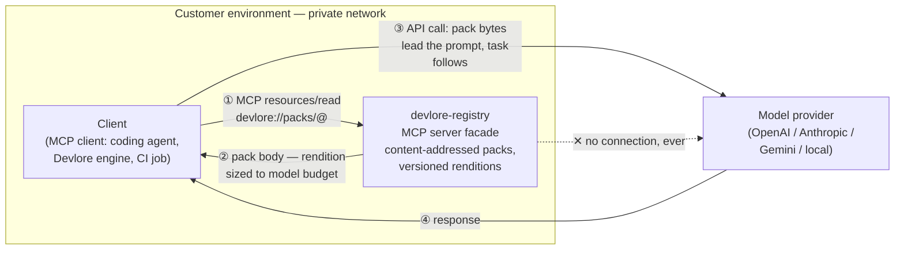

# Devlore AI Capability — Design Brief
## CAG Architecture and the Docs-to-Lore Pipeline

**Status:** next order of business.
**Goal (north star):** *Read the installation instructions for a piece of software and produce a lore package that deploys, upgrades, reconciles, and decommissions it.*

---

## 1. Purpose

Devlore gains AI capability through portable context, not hosted models. Knowledge is packaged as CAG (cache-augmented generation) assets — curated, versioned text artifacts stored in the devlore-registry — and consumed by whatever LLM each customer prefers (BYOM). The first capability built on this architecture is the docs-to-lore pipeline: given a vendor's human-oriented install documentation, an LLM equipped with Devlore's packs authors a complete lifecycle lore package.

Two use cases share the architecture and are deliberately kept distinct:

- **Devlore, the product** — CAG assets consumed in customers' LLMs, in customers' environments, on customers' bills. Devlore never hosts production inference.
- **Devlore development** — AI-assisted construction of Devlore itself; serves as **customer zero** for the product's packs and portability claims.

## 2. Architecture

Three elements; one trust boundary.



Properties the diagram encodes:

- **The client is the only bridge.** The registry lives inside the customer perimeter; model providers never reach it. No public endpoint, OAuth, or exposure story is required for the core product. (A public streamable-HTTP MCC endpoint for hosted-chat clients is a possible later feature, not a foundation.)
- **The registry core is protocol-neutral.** Content-addressed storage, immutable versions, mutable tags, renditions. MCP and REST are thin facades over the same API.
- **MCP is the delivery socket.** The registry exposes packs as MCP *resources* (`devlore://packs/conventions@12`) and as a *tool* (`get_pack(name, max_tokens)` → rendition fit to the caller's budget, so clients need not know renditions exist). MCP delivers bytes into context; it knows nothing of caching or placement.
- **Provider adapters own placement.** Per-provider prompt-caching mechanics (automatic prefix caching, explicit cache-control breakpoints, paid cache objects with TTLs) live in a small adapter layer. The pack's bytes never contain provider idioms.

## 3. CAG Pack Anatomy

A pack is disciplined text plus a manifest. The body enters model context; the manifest never does.

**Manifest (registry metadata):** name, version, content hash, budget class, per-tokenizer token counts (measured at publish), stability boundary marker.

**Body disciplines:**

1. **Stability-ordered.** Stable core (vocabulary, invariants) first; volatile material appended at the tail; edits to the tail never invalidate a cached head. Provider prefix caches and local KV caches both reward this identically.
2. **Deterministic serialization.** Same source → same bytes, always. Stable key ordering, no timestamps, no map-iteration nondeterminism. Enforced at publish (see §4).
3. **Model-robust prose.** Definitions, invariants, one worked example per concept. No persona framing, no provider syntax, no reliance on any single model's quirks.
4. **Renditions.** full / compact / minimal generated from one source and versioned together, so an 8K-context model and a 200K-context model consume the same knowledge at different depths.

## 4. Registry Requirements (delta to current spec)

- **Artifact classes:** *source* (authored packs — permanent, the unit of provenance), *derived* (regenerable, evictable, invalidated by input hashes; e.g., renditions if generated, local warm-KV caches in dev), *metadata* (per-consumer facts — tokenizer counts — that vary without changing artifact identity).
- **Determinism gate at publish:** serialize twice, compare hashes, reject on mismatch. A pack that cannot be reproducibly serialized cannot be honestly content-addressed.
- **Provenance hook:** a workflow run records the pack versions in context, in the same trace that records its other inputs. "What did the model know when it authored this" is a queryable fact.
- **MCP facade:** resources + `get_pack` tool as above; stdio and HTTP transports for in-perimeter clients.

## 4a. Registry Structure — Unsettled

The registry serves two purposes, and their directories are not yet named in a way that
distinguishes them. This section records where that discussion has got to. Nothing here is
decided; the layout is a strawman and the naming is deliberately deferred to the reorg, when the
tree's shape will make the choice obvious.

### What is there today

```
packages/     lore packages — docker, kubectl, terraform: deployable lifecycle definitions
knowledge/    prompts, concepts, schemas, transforms, signatures, slots, bindings, providers
```

`packages/` is consumed by the devlore engine, executing a lifecycle. `knowledge/` is consumed by
an LLM, as context. They have almost nothing in common but a parent.

### Why `knowledge/` is the wrong name

**The brief already uses a different word, precisely.** §1 says *"Knowledge is packaged as CAG
assets"* — knowledge is the raw material, the pack is the artifact. The URI is
`devlore://packs/conventions@12`; the tool is `get_pack()`; §3 is *"CAG Pack Anatomy"*. The
directory names the input while the registry stores the output.

**It collides with a process of the same name.** devlore-cli's `knowledge-extract` workflow
generates *into* this tree, so `knowledge` is simultaneously a devlore-cli operation and a
devlore-registry directory. `knowledge/packages/index.yaml` and `packages/index.yaml` are
unrelated files whose names imply a relationship.

**The contents are not knowledge in a useful sense.** `prompts/` holds model instructions
(*"You are a migration assistant for writ…"*), `concepts/` a structured taxonomy, `schemas/`
contracts, `transforms/` and `signatures/` detection rules, `bindings/` and `slots/` wiring.

### Why `authoring/` is also wrong

Two independent reasons, and each is sufficient.

**The tree serves more than authoring.** Counting mentions per domain:

| Domain | writ | lore |
| --- | --- | --- |
| `migration/` | 175 | 21 |
| `package-authoring/` | 15 | 33 |
| `onboarding/` | 10 | 7 |
| `shared/` | 5 | 5 |

Migrating a dotfile manager authors nothing. A name drawn from one operation cannot hold three.

**The pack set says so too.** The required set in §5 is `devlore-conventions`,
`lore-package-authoring`, and `platform-<target>`. Only one of the three is about authoring;
`devlore-conventions` is vocabulary and invariants, `platform-<target>` is platform idiom.

### Why `packs/` was the leading candidate, and why it fails

A pack is defined by its **form** — disciplined text plus a manifest, stability-ordered,
deterministically serialized, renditions versioned together — not by its purpose. That is exactly
the property required when one tree feeds writ migration, lore authoring, and onboarding:
`devlore-conventions` and `lore-package-authoring` are the same kind of thing serving different
operations, and only a form-based name holds both. Every purpose-based candidate fails: pick
`authoring/` and migration does not fit; pick `guidance/` and the schemas do not.

It fails on a collision instead. **`packs/` beside `packages/`** is the worst available pairing —
near-synonyms in ordinary English, separable only by a convention the reader must already hold.
Nothing in `packages/docker/lifecycle.yaml` versus `packs/migration/prompts/…` says one deploys
software and the other enters a context window.

### On the word "pack" itself

Neither invented nor standard. "Pack" is long-established in software distribution — content
packs, language packs, resource packs — as a bundle of related assets shipped as a unit. Applied
to LLM context it is an *emerging* term, still stabilizing: "context pack", "context bundle", and
"memory pack" are used interchangeably with no settled definition.

Two cautions follow. The term is overloaded in this exact neighbourhood — *MCP capability pack*
already means a configured set of MCP servers, and this design puts an MCP facade in front of
these assets, so "devlore packs served over MCP" is ambiguous. And this brief's definition is
narrower and more disciplined than industry usage, which mostly means "some things we bundled".
The definition in §3 is doing the work; the word is not carrying it.

### Where it stands

Two candidates survive, and the reorg decides between them:

- **`context/`** — honest about the defining property (this material enters a model's context
  window; `packages/` never does), no collision, and it reads naturally across all three
  consumers. Weak in that "context" is generic, and inside this domain already means the window.
- **`cag/`** — precise and unambiguous, matching §3. Opaque to a newcomer, though this is a
  private registry consumed by our own tooling, which lowers that cost.

Ruled out: anything sharing a root with `packages/`.

**Renaming is deliberately deferred.** The directory name is the cheap part. A rename touches
`star devlore knowledge index|validate|extract`, the schema paths, both registry workflows, the
required-check contexts, and the `com.noblefactor.devlore.Knowledge` extension id. Settle what the
tree becomes, then rename once, on the way.

## 5. The Docs-to-Lore Pipeline

**Input:** vendor installation documentation (README, docs pages, PDF).
**Output:** a lore package — a Devlore graph artifact covering the four lifecycle operations, expressed entirely in Devlore's existing semantics:

| Lifecycle op | Devlore expression |
|---|---|
| **Deploy** | Install steps as **compensable actions** executed by **providers**, each returning a **receipt** |
| **Upgrade** | A version-transition graph; prior deploy's **trace** supplies the from-state |
| **Reconcile** | **Trace-based difference detection** between recorded and observed state; a convergence graph closes the gap |
| **Decommission** | **Compensation in reverse receipt order** — the machinery already specified in the failure-handling model |

The mapping is the design's quiet strength: the pipeline invents no new runtime semantics. Deployment lifecycle *is* the saga model Devlore already defines; the AI's job is translation from human prose into that vocabulary — which is precisely what CAG packs make portable across models.

**Pipeline stages:**

1. **Ingest** — fetch/normalize the vendor docs (this, not the packs, is where anything RAG-like would live someday; out of scope now).
2. **Author** — customer's LLM, loaded with the pack set, produces the lore package draft.
3. **Validate** — mechanical gates, no model judgment: schema/type check against Devlore's type system (closed Reason tokens, GuardResult semantics, condition-ladder legality, no Phase propagation across subgraph seams); every deploy action compensable or explicitly declared irreversible; dry-run plan.
4. **Vet** — human review. Same non-negotiable gate as the development workflow; generated infrastructure code executes nothing until a person approves it.
5. **Publish** — the lore package enters the registry with provenance: source docs hash, pack versions used, authoring model identity.

**Required pack set (the authoring context):**

- `devlore-conventions` — vocabulary, invariants, status model. Exists in crystallized form today; first pack to author.
- `lore-package-authoring` — the target schema, worked examples of complete packages, the lifecycle table above as normative guidance.
- `platform-<target>` (optional, per ecosystem) — conventions for systemd vs. containers vs. Homebrew-class targets, so the model maps "run the installer" to the right provider idioms.

## 6. Validation & Acceptance

- **First target:** one well-documented, uncomplicated piece of software with a real uninstall story (e.g., a single-node service of the nginx/PostgreSQL class). Success = its docs in, a lore package out, all four lifecycle ops executed against a disposable VM, decommission leaves no residue detectable by reconcile.
- **Portability proof (the product claim):** the same pack set and the same input docs, run through **at least two unrelated model families** (one frontier API + one local open-weights model), both producing packages that pass validation. Divergence in *quality* is expected and measured; divergence in *validity* is a pack bug.
- **Customer zero:** `devlore-conventions` is simultaneously loaded into the daily development workflow (Claude Code via MCP; local editor via context prepend). Authoring pain is product feedback; portability seams are bug reports against the adapter layer.
- **Eval matrix as CI:** pack@version × model fleet → validation pass rate and scored quality, run on existing hardware (Mac mini + metered API calls). No new infrastructure is required to begin.

## 7. Non-Goals

- No production model hosting, ever, in the product path.
- No fine-tuning; portability is the point and text is the portable asset.
- No retrieval pipeline; packs are curated and preloaded (CAG), not searched (RAG). Ingest of vendor docs in §5 is input handling, not RAG.
- No provider idioms inside pack bytes; placement is adapter work.

## 8. Open Questions

1. The lore-package schema surface an LLM authors against: full graph DSL, or a constrained authoring subset that compiles to it? (A narrower target is easier to validate and easier to teach in a pack.)
2. Upgrade semantics: is upgrade a first-class graph kind, or deploy-with-a-from-state? The trace model suggests the latter; the pack must teach whichever is true.
3. Where the vet gate lives in customer workflows — Devlore-enforced (package status: draft → vetted → published) or convention?
4. Rendition generation: authored by hand per tier, or derived (compact/minimal compiled from full)? Derived keeps one source of truth but makes renditions *derived-class* artifacts with their own validation.
